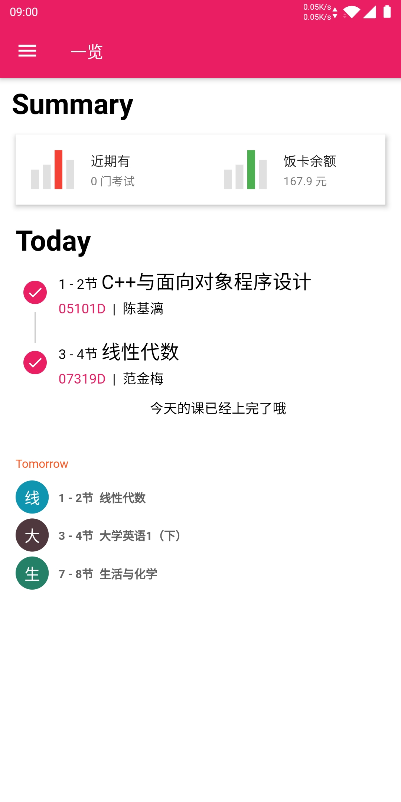
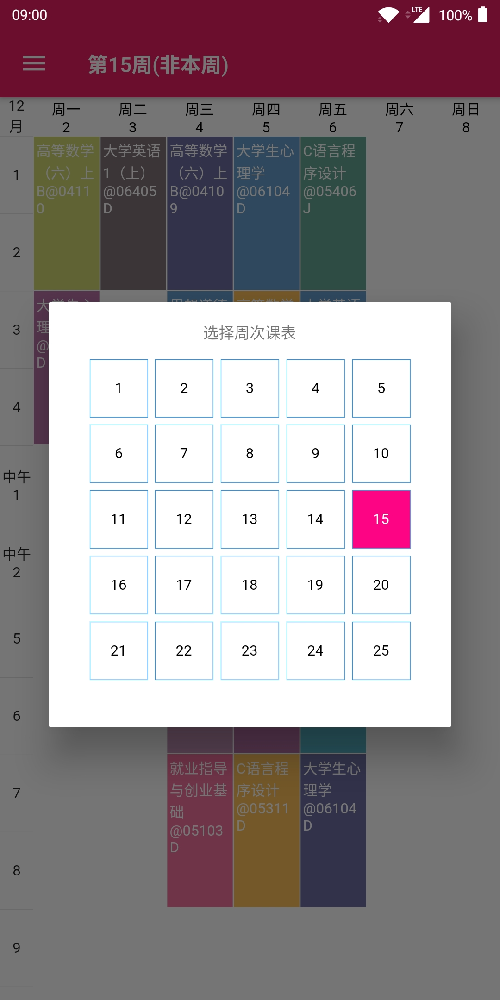
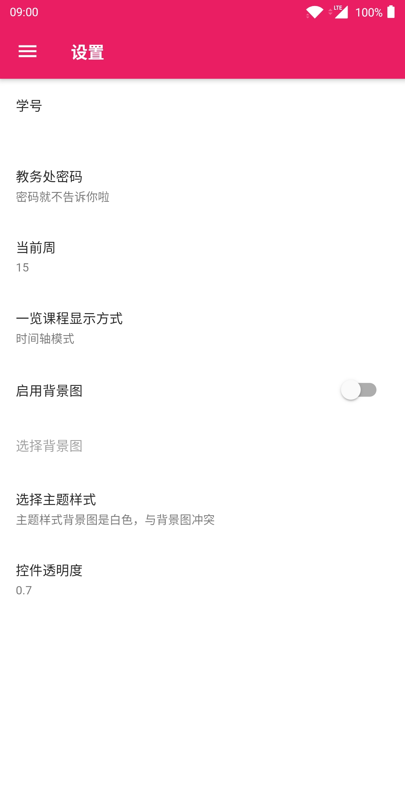
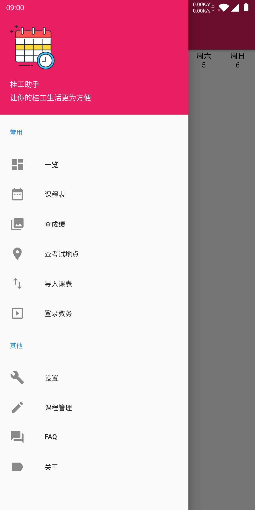

# 桂工助手


适用于桂林理工大学教务系列的 Android APP，包含了各种常用的教务查询。

## 功能

* 课程表(支持课程管理)
* 成绩查询(课程成绩，体侧成绩)
* 考试地点查询
* 支持教务登录，统一身份认证登录，南宁校区

## 截图







## 下载

* 前往 [release](https://github.com/flylai/GlutAssistant/release) 界面
或
* [酷安](https://coolapk.com/apk/com.lkm.glutassistant) 进行下载

## 编译

```
flutter build apk
或者
flutter build apk --target-platform android-arm,android-arm64 --split-per-abi
```

## 协议

MIT.